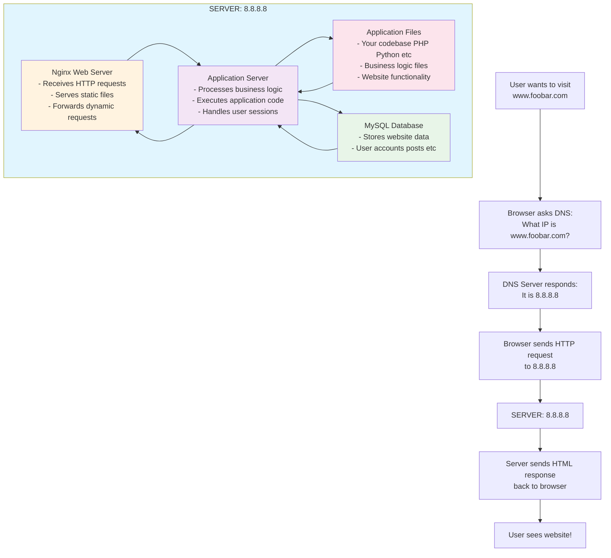

## Infrastructure Components:
- 1 Server (IP: 8.8.8.8)
- Domain: foobar.com with www A record pointing to 8.8.8.8
- Nginx web server
- Application server
- MySQL database
- Application files (codebase)

## Request Flow:
1. User types www.foobar.com
2. DNS resolves to 8.8.8.8
3. HTTP request sent to server
4. Nginx receives request
5. Application server processes logic
6. MySQL provides data
7. Response sent back to user

## Infrastructure Issues:
- SPOF: Single server failure = complete outage
- Downtime during maintenance/deployments
- No horizontal scaling capability
- Limited by single server resources

