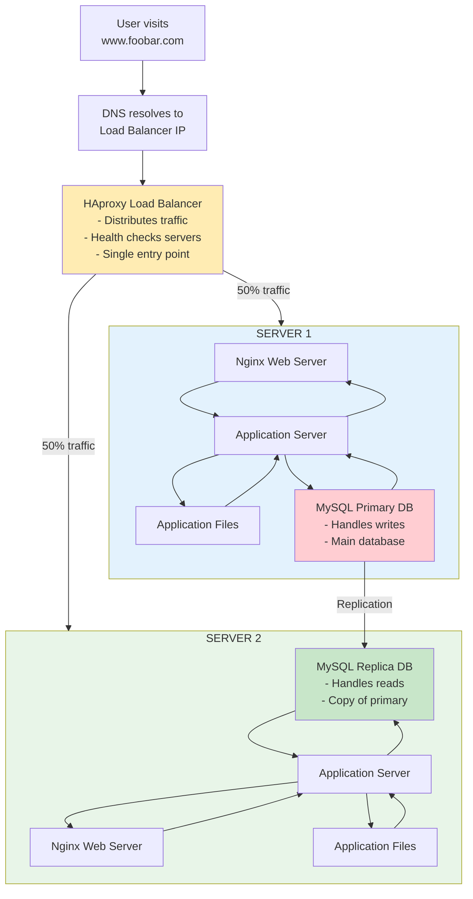

# 1. Distribited Web Infrastructure

## Components Added:
- 1 HAproxy Load Balancer
- 2 Servers (each with Ngnix, App
Server, App Files, MySQL)
- Primary-Replica database setup

## Why Each Addition:
- Load Balancer: Eliminates server SPOF, distributes traffic
- Second Server: Provides redundancy and scales capacity
- Database Replication: Separates reads/writes, improves performance

## Load Balancer Configuration:
- Algorithm: Round Robin (alternates requests between servers)
- Setup: Active-Active (both servers handle traffic simultaneously)

## Database Cluster:
- Primary: Handles all writes, replicates to Replica
- Replica: Handles reads, receives updates from Primary

## Issues:
- SPOF: Load Balancer Primary database
- Security: No firewall, no HTTPS encryption
- Operations: No monitoring system implemented
