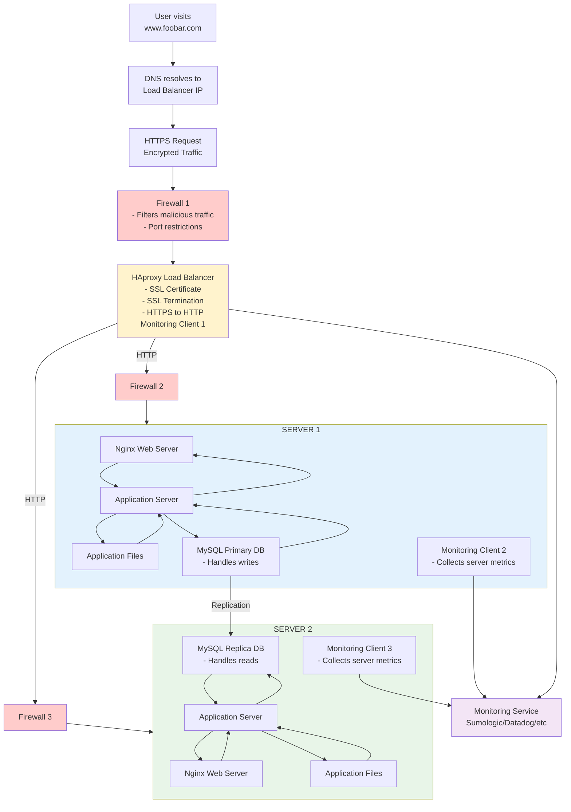

# 2. Secured Web Infrastructure

## Added Security Components:
- 3 Firewalls (load balancer + 2 servers)
- 1 SSL Certificate (HEEPS encryption)
- 3 Monitoring clients (data collection)

## Components Purposes:
- Firewalls: Nertwork security, malicious traffic filtering
- SSL: Data encryption, user trust, compliance
- Monitoring: Performance tracking, proactive issue detection

## Monitoring Implementation:
- Agents collect system/app metrics every 60 seconds
- Data sent to centralized monitoring service
- QPS monitoring via Nginx status module + metric calculation

## Infrastucture Issues:
- SSL termination: Internal traffic unencrypted
- Single writer: MySQL Primary SPOF for writes
- Mixed components: Inefficient resource utilization, scaling limitations