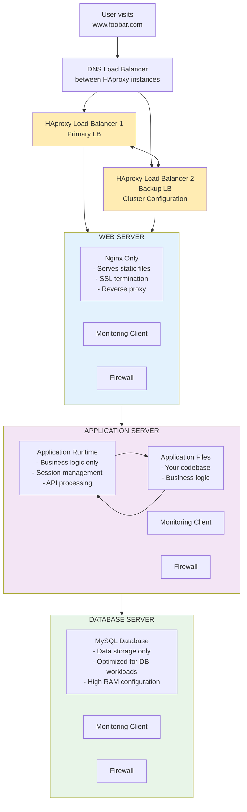

# 3. Scale Up Infrastructure

## Added Components:
- 1 Additional HAproxy Load Balancer (clustered configuration)
- 1 Dedicated Web Server (Nginx only)
- 1 Dedicated Application Server (business logic only)
- 1 Dedicated Databade Server (MySQL only)

## Why Each Addition:
- Second Load Balancer: Eliminates LB SPOF, enables maintenance without downtime
- Separated Components: Independent scaling, resource optimization, better performance

## Component Separation Benefits:
- Web Server: Optimized for static content, SSL termination, caching
- Application Server: Optimized for code execution, business logic processing
- Database Server: Optimized for data storage, query performance, high I/O

## Scaling Advantages:
- Independent Component scaling based on specific bottlenecks
- Resource optimization for eaxh workload type
- Easier troubleshooting and maintenance